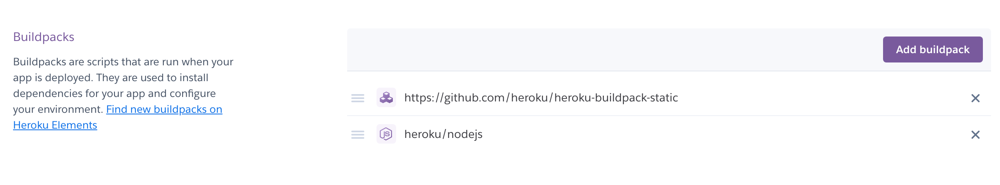

# Deploy parcel/ react frontend + express backend

### AWS EC2/ GCP GCE

This is simple, just remote transfer (scp)/ git pull the code from local machine to the remote machine and run the code just like how you would run on your local machine after setting up node, npm, and other environments.

To visit the website, just fetch the ip address/ connection url of the remote machine and append it with the corresponding port (i.e. replace localhost with the remote ip address `localhost:3000` --> `remote_ip:3000`). Make sure whichever port is in use is accessible.

### Heroku

While deploying to remote servers is probably the easiest way, it might not be the most feasible or economic solution because you have to pay for the entire server. Therefore, we would like some alternatives such as deploying to website hosting websites. I will use Heroku as an example to illustrate (note: different hosting websites have different commands so the exact deploy instructions won't be the same, but general ideas apply).

First, we need to understand what kinds of things we are deploying. In our frontend/ backend example bundled with parcel, we have two items that need to be done when deploying
1. build the frontend static files using `parcel build` and move the static files to a `dist` folder (or any folder we can later access from backend)
2. start the backend server using `node server.js`

All working code is inside this repo. Below I will explain the deploy instructions/ changes I made.

**Buildpacks**

On the settings page on Heroku, under buildpacks, click on *add buildpack* to add the following two things
1. `https://github.com/heroku/heroku-buildpack-static`
2. `heroku/nodejs`

The first buildpack is for building the static files in the frontend and the second buildpack is for starting the backend express server. **Note: order matters**, we have to first build the static files before we can retrieve them from the backend.



**Local code**

In our local code, we need to change several things

In `server.js`, instead of hard-coding the port number to be 3000, define a variables `const PORT = process.env.PORT || 3000` and use `PORT` in `app.listen()`. This is done to allow Heroku using other ports for our website.
Also if you are using local mongoDB URI, you want to change it to MongoDB Atlas URI so it is a remote database. Change IP address access to be anywhere so anyone could visit your website. Refer to this [link](https://www.freecodecamp.org/news/get-started-with-mongodb-atlas/) to see how.


In `package.json`, add the following commands to `scripts`,
```
"frontend": "parcel build frontend/src/index.html",
"server": "node backend/index.js",
"dev2": "npm run frontend && node backend/index.js",
```
Note that here in `dev2`, we are no longer using `concurrently`. Because we want to **first** build the static files and **then** start the backend.

Create a new file called `static.json` in your root directory with the following
```js
{
  "root": "dist/",
  "routes": {
    "**": "index.html"
  }
}
```
Here, we specify where the static files to be put which is `dist/` and we specify the entry points for the static files which is `index.html`

Lastly, create another new file called `Procfile` in your root directory which contains `web: npm run dev2`. Here, we are telling Heroku what to run/ which command to run when building our website.

To see how to commit/ upload the code to Heroku, refer to the *Deploy* tab. You can either using command-line or Github.


<ins>Alternatives</ins>
Here's a [link](https://markmurray.co/blog/express-parcel-react-now/) to how you would deploy on Now.

---
**Links I referred to when testing**
MongoDB
- https://www.freecodecamp.org/news/get-started-with-mongodb-atlas/
- https://www.mongodb.com/developer/how-to/use-atlas-on-heroku/

Heroku static files
- https://remarkablemark.org/blog/2022/03/16/deploy-parcel-build-to-heroku/
- https://elements.heroku.com/buildpacks/heroku/heroku-buildpack-static

Heroku stop building
- https://help.heroku.com/4RNNGYNU/how-to-stop-a-stuck-build

Procfile
- https://devcenter.heroku.com/articles/getting-started-with-nodejs?singlepage=true#define-a-procfile
- https://devcenter.heroku.com/articles/procfile